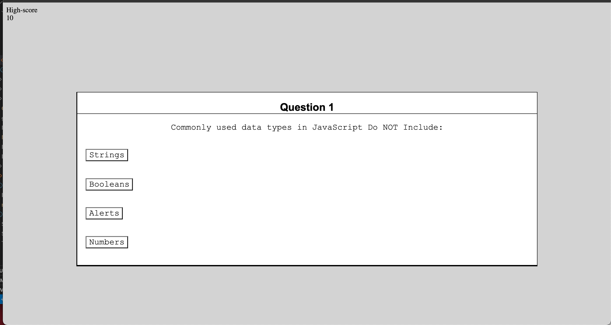

### Coding-Quiz:
This is a JavaScript/Web APIs challenge for my coding bootcamp.  Our goal as to create a timed quiz about JavaScript. Style wise it is a bit rough in a few places but it does meet all the Acceptance Criteria.  Here is what it does:

## Timer:
When the came starts there is a timer that counts down.  Answer questions increases the timer by 10 seconds and answering the questions incorrectly decreases the timer by 10 seconds.  When the timer reaches 0 the game ends.

## The game ends:
The game can end one of two ways.  Either the timer runs out, you proceed through all the questions until the end.

## Saving the score:
The game does allow for a user to save their score.  It will also desplay scores from previous users.  This part if a bit rough but functional.  

## Over all reflections:
This project was a tough for me and a recieved a LOT of help.  Structurally most of the ideas about how the quiz should work was my idea, only once or twice did I recieve help in WHAT to do next.  Most of the time, I needed help on what method/syntax to use.  I was able to describe what to do, just not know how to talk to the computer how to do it. 

## Some special thanks for:
Andrew Janses my good friend who is mentoring me in during this code camp
Telah Aliyev my Tutor Support in the program
Thanks to the U of M Bootcamp staff that answered a few questions here and there. 

Below is a link to the App:
# Link to App:
<a href="https://danielp1742.github.io/Coding-Quiz/">Git Page</a>

Here is an image of the quiz:
# Screen Shot of App:

